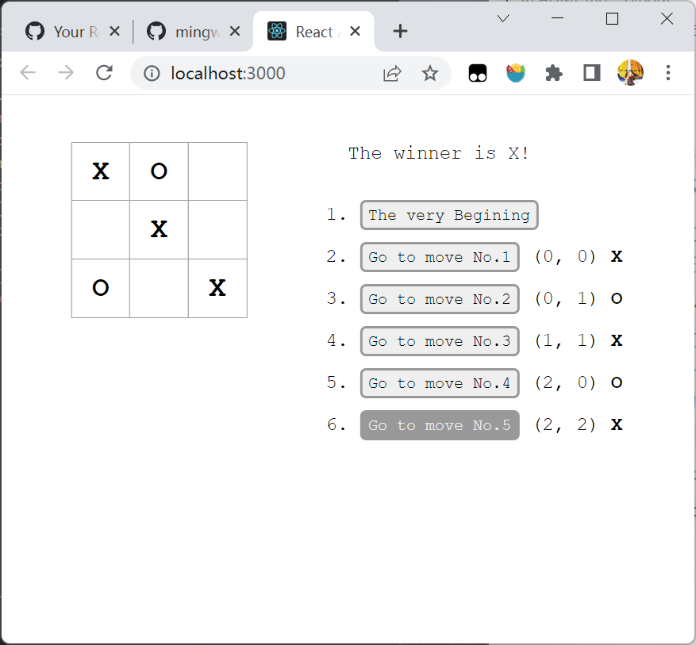

##### 井字棋

先写了原生`JavaScript`版，`React`框架主要的方便之处就是一切对`DOM`的操作和修改都由它来做。

一开始我是将二维数组的值设为`-1`, `0`, `1`三种，分别对应格子的三种状态。同时再判断是获胜方的时候也可以直接通过对八条连线进行求和。

同时在用原生`JS`写的时候，需要将每个格子的坐标作为元素的一个自定义数据属性，方便在点击的时候记录修改并且加入`history`队列中。当然用框架写也有这个内容，就是通过`map`遍历数组然后编写`jsx`同时加上事件监听。回调的时候带上坐标参数即可。比起原生的去拿`e.target.dataset.index`，还是更加方便了一些。

同时`React`每次落子都会重新生成一遍虚拟`DOM`，而原生的是直接修改对应格子`innerText`。



主要是分为了三个部分，最高层的父组件`Game`，维护一个`histories`队列，同时将监听函数`handleClick`以及当前的棋盘`board`传给子组件`Board`，`Board`类主要是将二维数组渲染出来，由于二维数组用了两次`map`，所以`board-row`需要带上一个`key={xIndex}`，而每个格子也要带上一个`key={yIndex}`。

由于格子和行都不会由增加、删除以及重新排序或者更新列表项的问题，所以完全可以直接将索引作为`key`就不会报错了。当然如果会重新排序还是需要一个独一无二的`ID`类似主键。

主要的逻辑处理部分都在`Game`类中了，包括两个事件监听以及组件的渲染

```js
// 游戏类，包括棋盘以及信息两个部分
class Game extends React.Component {
    constructor(props) {
        super(props);

        this.state = {
            histories: [
                {
                    squares: new Array(3)
                        .fill(0)
                        .map((row) => new Array(3).fill(null)),
                },
            ],
            curHistoryIndex: 0,
            xIsNext: true,
        };

        /* 全局维护获胜者，反正每次重新渲染都会算一遍 */
        this.winner = null;
        this.handleClick = this.handleClick.bind(this);
        this.timeTravel = this.timeTravel.bind(this);
    }

    /* 落子的方法 */
    handleClick(xIndex, yIndex) {
        const formerSquares =
            this.state.histories[this.state.curHistoryIndex].squares;
        /* 二维数组要深克隆一下 */
        const squares = formerSquares.map((row) => [...row]);
        /* 只有当没人获胜并且格子为空的情况下能落子 */
        if (this.winner === null && squares[xIndex][yIndex] === null) {
            /* 更新棋盘 */
            squares[xIndex][yIndex] = this.state.xIsNext === true ? "X" : "O";
            /* 保证后面多余的历史删掉 */
            const histories = this.state.histories.slice(
                0,
                this.state.curHistoryIndex + 1
            );
            /* 使用concat会返回一个新数组，明确修改不可变数据 */
            this.setState({
                histories: histories.concat({
                    squares: squares,
                    xIndex,
                    yIndex,
                }),
                curHistoryIndex: this.state.curHistoryIndex + 1,
                xIsNext: !this.state.xIsNext,
            });
        }
    }

    /* 回退历史记录 */
    timeTravel(index) {
        /* 偶数的时候下一步才是X */
        if (index !== this.state.curHistoryIndex) {
            this.setState({
                curHistoryIndex: index,
                xIsNext: (index & 1) === 0,
            });
        }
    }

    render() {
        const curBoard =
            this.state.histories[this.state.curHistoryIndex].squares;

        /* 得到所有按钮 */
        const gotoBtns = this.state.histories.map((move, index) => {
            const description =
                index === 0 ? "The very Begining" : `Go to move No.${index}`;
            const cordinates =
                index === 0 ? "" : `\n(${move.xIndex}, ${move.yIndex})`;
            const selected =
                index === 0
                    ? ""
                    : `\n${move.squares[move.xIndex][move.yIndex]}`;
            const btnClass = classNames("history", {
                "cur-btn": index === this.state.curHistoryIndex,
            });
            return (
                <li key={index}>
                    <button
                        className={btnClass}
                        onClick={() => this.timeTravel(index)}
                    >
                        {description}
                    </button>
                    {cordinates}
                    <span className="selected">{selected}</span>
                </li>
            );
        });

        /* 判断当前状态 */
        const winner = judgeWinner(curBoard);
        this.winner = winner;
        let status;
        if (winner !== null) {
            status = `The winner is ${winner}!`;
        } else {
            status = `Next goes to ${this.state.xIsNext === true ? "X" : "O"}`;
        }
        return (
            <div className="game">
                <div className="game-board">
                    <Board
                        board={curBoard}
                        onClick={this.handleClick}
                        xIsNext={this.state.xIsNext}
                    />
                </div>

                <div className="game-info">
                    <div className="status">{status}</div>
                    <ol className="histories">{gotoBtns}</ol>
                </div>
            </div>
        );
    }
}
```

棋盘类用于渲染整个棋盘

```js
/* 棋盘类 */
class Board extends React.Component {
    /* 调用函数组件Square */
    /* 代表事件监听的prop命名为on[Event] */
    /* 处理的监听方法命名为handle[Event] */
    render() {
        /* map遍历得到所有行 */
        const rows = this.props.board.map((row, xIndex) => {
            /* map遍历得到一行中的所有格子 */
            const cells = row.map((value, yIndex) => (
                <Square
                    value={value}
                    key={yIndex}
                    onClick={() => {
                        this.props.onClick(xIndex, yIndex);
                    }}
                />
            ));

            return (
                <div className="board-row" key={xIndex}>
                    {cells}
                </div>
            );
        });
        return <div className="board">{rows}</div>;
    }
}
```

由于格子`Square`没有状态所以完全不需要`constructor`，同样也只负责渲染。所以重写为一个函数组件

```js
/* 函数组件，接收一个props，返回jsx */
function Square(props) {
    return (
        <button className="square" onClick={props.onClick}>
            {props.value}
        </button>
    );
}
```

一下判断一个`board`二维数组是否都连线，因为是值所以无法通过数字求和进行判断

```js
// 判断获胜方
function judgeWinner(board) {
    /* 判断是否有胜方 */
    for (let i = 0; i < 3; i++) {
        /* 判断三行 */
        if (
            board[i][0] !== null &&
            board[i][0] === board[i][1] &&
            board[i][1] === board[i][2]
        ) {
            return board[i][0];
        }

        /* 判断三列 */
        if (
            board[0][i] !== null &&
            board[0][i] === board[1][i] &&
            board[1][i] === board[2][i]
        ) {
            return board[0][i];
        }
    }

    /* 判断两条交叉线 */
    if (board[1][1]) {
        if (board[0][0] === board[1][1] && board[1][1] === board[2][2]) {
            return board[1][1];
        }

        if (board[0][2] === board[1][1] && board[1][1] === board[2][0]) {
            return board[1][1];
        }
    }

    return null;
}
```

`React`中很重要的一部分内容可能是不可变数据。它并不会监听是否数据是否发生了，所以使用`setState`以外的方式直接更改状态数据的时候会警告应该用`setState`来修改。

不可变数据最大的优势就是创建`pure components`，直接将对象换成一个新的元素，`React`可以很轻松地通过判断引用对象是不是发生了改变来决定是否需要重新渲染了。而不用通过整个遍历对象来跟踪数据地改变。

同时这个小游戏非常重要地一个功能部分就是要回溯历史记录，故而应该直接深克隆一个新的对象`concat`进`histories`数组中去。同时每个元素最好是一个对象，可以记录包括`squares`，`xIndex`，`yIndex`，`selected`等一系列状态信息。

至于为什么用`concat`而不用`push`，因为`concat`是直接返回一个新对象。`push`，`splice`之类的都是在原数组上进行操作。而且`concat`进来的必须是一个深克隆的对象。才不会有引用问题。